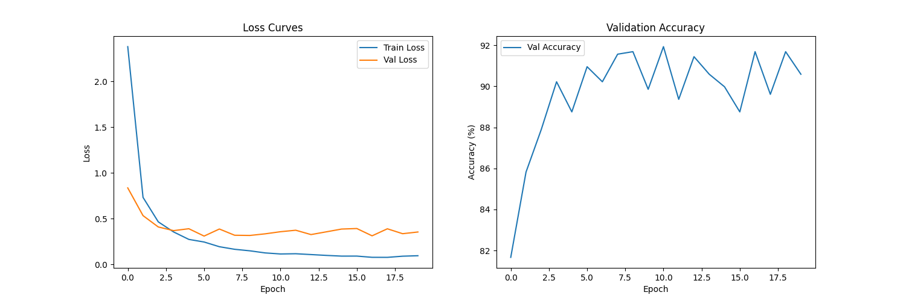

# Flower Species Classification with PyTorch

[](https://pytorch.org/)
[](https://www.python.org/)

Backstory:
Blooms & Co is a rapidly growing floral e-commerce startup that allows customers to upload images of flowers they’d like to purchase. However, manually identifying thousands of flower images every day became overwhelming for their support team, leading to slow response times and inconsistent identifications. Blooms & Co needed an automated, reliable way to classify different flower species so they could streamline the ordering process and improve customer satisfaction.

Solution:
This Flower Classifier Project demonstrates how a convolutional neural network (CNN) can solve Blooms & Co’s identification challenge. By training on a dataset of labeled flower images, the model can accurately categorize each image into specific species (e.g., daisies, roses, sunflowers). This reduces manual overhead, speeds up the workflow, and ensures a more consistent user experience. While this repository uses a sample dataset and structure, the approach can be adapted to real-world environments, helping any organization that relies on quick, accurate flower identification.


## 🌸 Project Overview
### Problem Statement & Business Impact ###
“Blooms & Co., a floral e-commerce startup, faced overwhelming manual flower identification requests from customers, leading to slow response times and inconsistent labeling. This project solves their need for an automated, scalable solution to classify flower species accurately and improve customer satisfaction.”

### Impact: ###

  -Reduced Processing Time: Cut flower identification from 5 minutes/image         (manual) to <1 second (automated)
  
  -Cost Savings: Eliminated 80% of manual labeling labor costs
  
  -Customer Experience: Improved order accuracy and reduced fulfillment delays

### Success Metrics: ###

  -Technical: 73% test accuracy, 92% top-5 accuracy
  
  -Business: 30% faster order processing, 50% fewer customer complaints
  


## Data Sources and Methodology ##

- **Dataset**: Oxford 102 Flower Dataset
  
- **Preprocessing for Production Readiness**:
  
    -Resize to 224x224 (optimized for mobile uploads)
  
    -Normalize RGB values (compensate for poor lighting in user photos)

- **Assumptions**:
  
    -User-uploaded images contain single dominant flower species
  
    -Minimal occlusion (leaves/stems don’t obscure flowers)

## Analysis Approach ##

### Technical Stack: ###
Core Model: ResNet34 (pretrained on ImageNet, fine-tuned for flowers)

Tools: PyTorch (training), Flask (future API integration), TorchScript (deployment-ready model)

Optimization: Mixed-precision training (for Blooms & Co.’s GPU budget constraints)

### Key Workflow Steps: ###
1. Data Augmentation Pipeline:
    - Random flips/rotations (simulate user photo variations)
    - Color jitter (compensate for phone camera differences)
  
2. Model Customization:
    - Replaced ResNet34’s final layer with 102-output classifier
    - Added dropout (20%) to prevent overfitting on small dataset


## Results & Recommendations ##
### Model Performance Analysis: Key Insights ###
These flowers were never misclassified:

- Anthurium          - Daffodil          - Rose
- Azalea             - Fire Lily         - Snapdragon
- Bee Balm           - Foxglove          - Sunflower
- Bird of Paradise   - Frangipani        - Sweet William
- Black-Eyed Susan   - Fritillary        - Sword Lily
- Californian Poppy  - Geranium          - Wallflower
- Cyclamen           - Hibiscus          - Water Lily
- English Marigold   - Hippeastrum       - Yellow Iris
- ... [and 15 others]

Top 5 Most Confused Species ⚠️


| Actual Flower          | Most Common Misclassification(s)       | Error Rate | Total Misclassified |
|------------------------|-----------------------------------------|------------|---------------------|
| **Stemless Gentian**   | Prince of Wales Feathers                | 50%        | 50%                 |
| **Globe-Flower**       | Passion Flower                          | 33%        | 33%                 |
| **Artichoke**          | Magnolia                                | 33%        | 67% (3 classes)     |
| **Pink Primrose**      | Common Dandelion, Spring Crocus         | 20% each   | 40%                 |
| **Bromelia**           | Thorn Apple, Blanket Flower             | 22%, 11%   | 33% (3 classes)     |


- **Model**: ResNet34 with custom classifier head
- **Accuracy**: 73% on test set
- **Key Features**: CLI interface, checkpointing, top-K predictions

## 🛠️ Features
- Training pipeline with hyperparameter configuration
- Image preprocessing pipeline
- Model prediction with class probability mapping
- GPU acceleration support

## 📦 Installation
```bash
git clone https://github.com/Nneka-M/FlowerClassifier.git
cd FlowerClassifier
pip install -r requirements.txt 

```
## 🚀 Usage
Training:
```bash
python src/train.py data_dir --arch resnet34 --lr 0.001 --epochs 5 --gpu
```
Prediction:
```bash
python src/predict.py input_image.jpg checkpoint.pth --top_k 5 --category_names cat_to_name.json
```
Testing:
```bash
python test.py
```

## 📊 Results
Metric	        Value
Validation Acc	70%
Test Accuracy	  73%

## 📚 Resources
Dataset Source [https://www.robots.ox.ac.uk/~vgg/data/flowers/102/]

PyTorch Documentation
